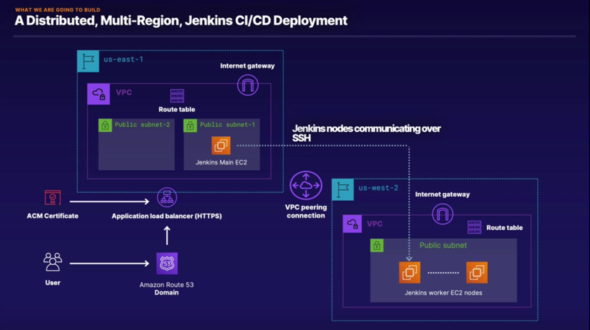

# aws-jenkins-terraform
A repository with a Jenkins deployment at AWS using Terraform

The goal of this repository is to deploy a distributed, highly-available Jenkins on AWS through the usage of Terraform and Ansible, spread across two different regions (us-east-1 and us-west-2) through the usage of multiple terraform resources such as:
- IAM
- VPC
  - Subnet
  - VPC Peering
- Security Groups (Network policies)
- EC2 Instances
- Route53 (DNS)
- ACM (Certificate Manager)
- Application Loadbalancer

## Overview architecture

Feel free to reach out to me at:

[Twitter](https://twitter.com/schmittfelipe) | [Github](https://github.com/fsschmitt) | [Website](https://felipeschmitt.com)
